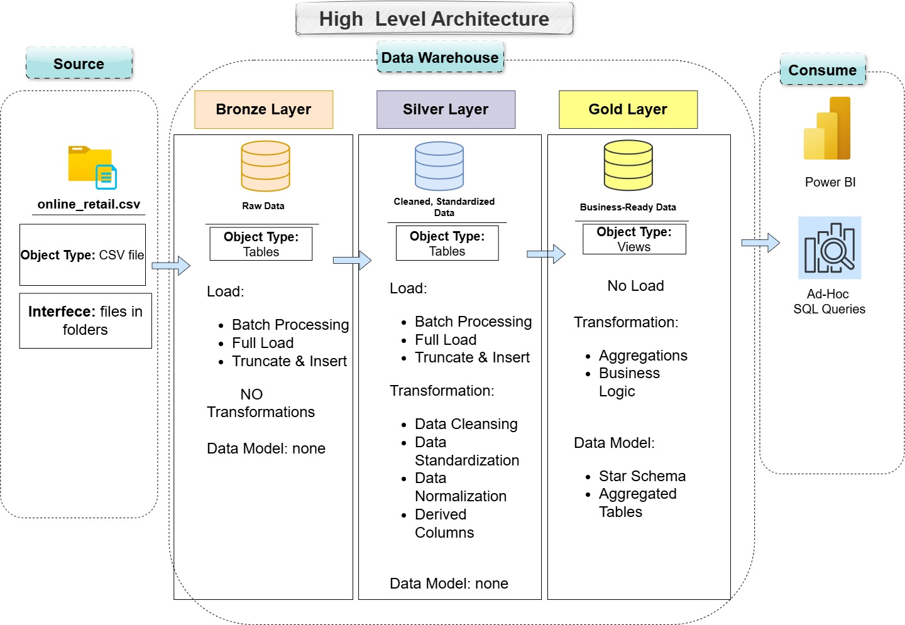

# End-to-End Analytical Data Pipeline  
## Bronze–Silver–Gold (Medallion) Architecture for Retail Transactional Data

This project implements an **end-to-end analytical data pipeline** using the **Medallion Architecture (Bronze → Silver → Gold)** to process large-scale retail transactional data.  
The pipeline is built **entirely in T-SQL**, designed to transform raw transaction records into **business-ready analytical models** optimized for reporting, analytics, and decision-making.

---

## 1. Project Context

The dataset contains **over half a million transactions** from a UK-based non-store online retailer operating between **December 2010 and December 2011**.

The data reflects real-world retail complexity, including:
- High transaction volume
- Mixed product types (physical goods, postage, fees, manual adjustments)
- Invoice cancellations and corrections
- Wholesale purchasing behavior (large quantities, high invoice values)
- Missing customer identifiers
- Multi-country sales activity

The project demonstrates how to **systematically clean, standardize, and aggregate transactional data** using a layered architecture suitable for enterprise analytics.

---

## 2. Medallion Architecture Overview

The Medallion Architecture organizes data into **three logical layers**, each with a clear responsibility:

### 🥉 Bronze Layer — Raw Ingestion
- Stores data **as received** from the source
- Minimal or no transformation
- Preserves original structure and values
- Acts as a historical record of raw data

**Purpose:** Data capture and traceability

---

### 🥈 Silver Layer — Cleaned & Standardized Data
- Applies data cleaning and validation rules
- Standardizes data types and formats
- Removes duplicates
- Handles nulls and invalid records
- Applies business rules (e.g., cancellations, invalid prices)

**Purpose:** Provide a reliable, analysis-ready transactional dataset

---

### 🥇 Gold Layer — Business-Ready Analytics
- Fully aggregated and curated tables
- Optimized for BI tools and reporting
- No raw fields or row-level noise
- Each table answers a specific business question

**Purpose:** Enable fast, trusted analytics and decision-making

> **Gold tables answer questions — they do not store events.**

---

## 3. Project Objective

The primary objective of this project is to:

> **Design and implement a scalable Gold Layer in T-SQL that transforms cleaned transactional data into business-ready analytical tables, enabling sales analysis, customer analytics, product performance evaluation, and time-based insights.**

---

## 4. Data Layers and Tables
!(Data Flow) [images2/data_flow.jpg]
### Bronze Layer (Raw Data)
**Description:** Source-aligned storage of transactional records.

**Typical Tables:**
- `bronze.fact_transactions_raw`

---

### Silver Layer (Cleaned & Conformed Data)
**Description:** Transaction-level data with enforced data quality and business rules.

#### Silver Layer Data Model
The Silver layer is implemented using a **Star Schema**, consisting of one central fact table and multiple conformed dimensions.

**Key Transformations:**
- Remove duplicate transaction rows
- Exclude cancelled invoices (`InvoiceNo LIKE 'C%'`)
- Enforce valid revenue logic (`Quantity > 0` and `UnitPrice > 0`)
- Standardize date and time formats
- Preserve `NULL` `CustomerID` values to support guest checkouts
- Resolve natural keys into surrogate keys during fact loading

**Fact Tables:**

- **`silver.fact_main`**  
  - Deduplicated transactional source table  
  - One row per raw invoice line  
  - Acts as the canonical cleaned dataset in Silver

- **`silver.fact_sales`**  
  - Analytical fact table  
  - Grain: **one row per invoice line (Product × Invoice × Date)**  
  - Stores measurable metrics such as quantity, unit price, and line-level revenue  
  - Uses surrogate keys to reference all dimensions

---
**Dimension Tables:**

- **`silver.dim_product`**  
  - Product master data  
  - Attributes include stock code, product name, and first-seen date

- **`silver.dim_customer`**  
  - Customer master data  
  - Tracks customer purchase lifecycle (first and last purchase dates)  
  - Supports nullable customers (guest transactions)

- **`silver.dim_country`**  
  - Conformed geographic dimension  
  - One row per country with enforced uniqueness

- **`silver.dim_date`**  
  - Calendar dimension  
  - One row per calendar day  
  - Enables time-based and seasonality analysis

---

### Gold Layer (Analytical Models)

#### 4.1 Sales & Revenue Analysis
**Business Question:**  
How much revenue is generated, when, and from where?

**Tables:**
- `gold.fact_sales_daily`
- `gold.fact_sales_monthly`
- `gold.fact_sales_country`

**Key Metrics:**
- Total Revenue
- Number of Orders
- Average Order Value (AOV)
- Revenue by Country
- Revenue by Time Period

---

#### 4.2 Customer Analytics
**Business Question:**  
Who are the most valuable customers and how do they behave?

**Tables:**
- `gold.fact_customer_value`

**Key Metrics:**
- Total Spend per Customer
- Number of Invoices
- Average Basket Size
- First and Last Purchase Dates

> Transactions with `NULL CustomerID` contribute to revenue but are excluded from customer-level analytics.

---

#### 4.3 Product Performance
**Business Question:**  
Which products drive revenue and sales volume?

**Tables:**
- `gold.fact_product_sales`

**Key Metrics:**
- Total Quantity Sold
- Total Revenue per Product
- Average Unit Price
- Revenue Contribution Percentage

---

#### 4.4 Time-Based & Seasonality Analysis
**Business Question:**  
When do customers buy, and how does seasonality affect sales?

**Tables:**
- `gold.fact_time_analysis`

**Key Metrics:**
- Revenue by Month
- Revenue by Day of Week
- Revenue by Hour of Day

---

## 5. Data Quality & Business Rules

To ensure trust and analytical accuracy, the Gold Layer enforces:

- Exclusion of cancelled invoices
- Exclusion of zero or negative revenue rows
- Separation of operational charges (postage, fees, manual adjustments)
- Clear table grain (one business meaning per table)

**Outcome:**  
Business users can query Gold tables **without needing to understand raw data quirks or operational anomalies**.

---

## 6. Technology Stack

- **SQL Server**
- **T-SQL**
- Medallion Architecture (Bronze–Silver–Gold)

---

## 7. Intended Use

This project is suitable for:
- BI reporting (Power BI, Tableau)
- Sales and customer analytics
- Portfolio demonstration of SQL-based data engineering skills
- Retail analytics case studies

---

## 8. Key Takeaway

This repository demonstrates how **raw transactional data** can be transformed into **trusted, high-performance analytical models** using a disciplined, scalable data architecture — implemented entirely in SQL.
